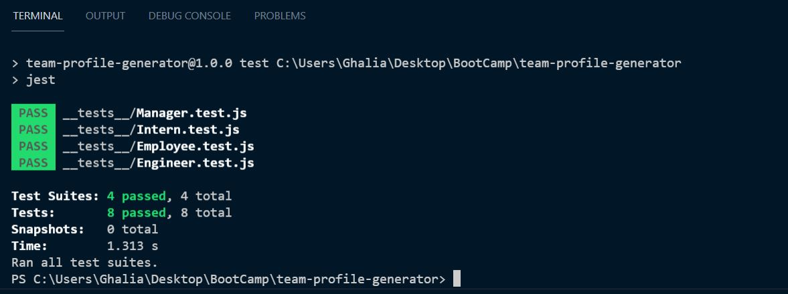

# team-profile-generator

## Purpose:
Creating a teamwork profile.

### Description:
A command-line prompt the user to enter:
* The team title, then the app will ask for
* The manager name, ID, email, and office phone number;
* After entering the Manager information, the app then asks:
* Do you want to add more team members?
* yes, add another manager', 'yes, add an Intent, 'yes, an Engineer', "No, create my teamwork page now!
* When the user finishes entering team information, an HTML page will be created based on the user entree.

## instructions : 
* install the npm package then enter 'node index' 
* Questions will prompt and after answering, the index.html file will be created.
* open the index file from the dir folder and team members will be displayed there.

## Usage:

## Testes:
All testes are passed 

### Contribution:
Made with ❤️️ by Ghalia Sami. 
For more information, Please contact me.
Email: ghaliarose89@gmail.com

### ©️ [2021] [Ghalia Sami]
